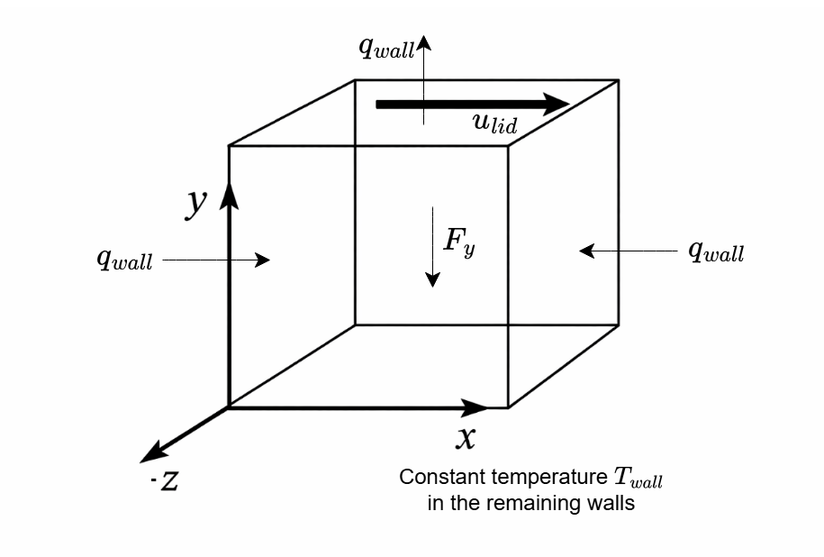
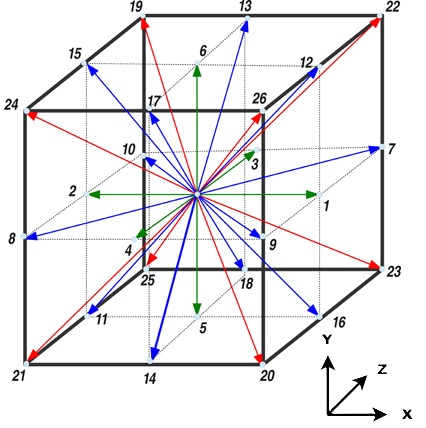
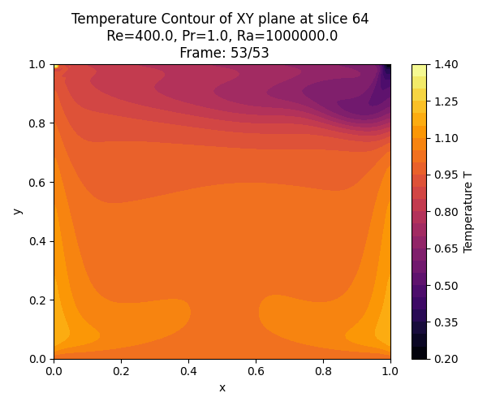
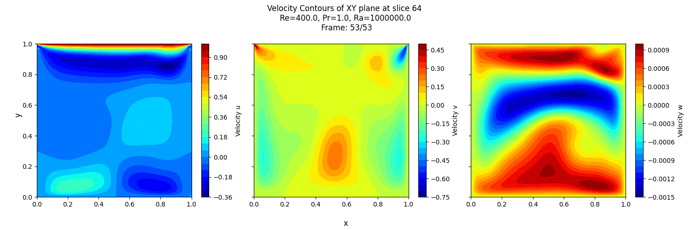
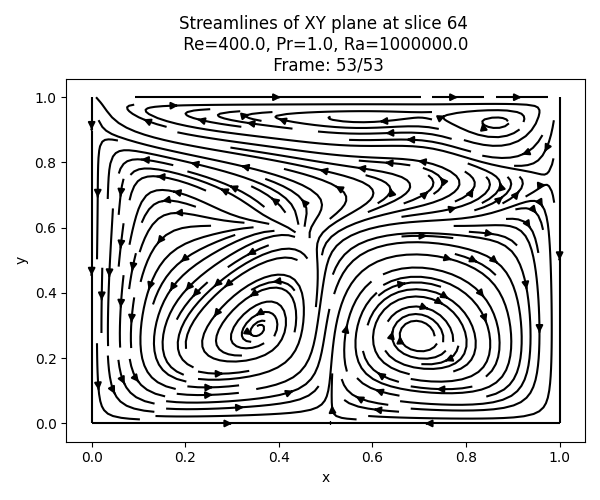

# GPU-Accelerated 3D LBM Solver for Heated-Lid Driven Cavity Flow

A CUDA-based implementation of the 3D Lattice Boltzmann Method (LBM) for simulating buoyancy-driven flow in a heated lid-driven cavity. The solver employs a D3Q27 lattice with separate distribution functions for momentum and temperature transport and is optimized for execution on NVIDIA GPUs.

## Physical Problem

The computational domain consists of a cubic cavity.

Boundary conditions:



Buoyancy force $F_y$ is modeled using the Boussinesq approximation.

## Preliminaries
### Governing Equation

Lattice Boltzmann Equation with BGK-approximation:

$\frac{\partial f}{\partial t} + \mathbf{c} \cdot \nabla f = \Omega(f) + S(f) \Rightarrow f_i(\mathbf{x} + \mathbf{c}_i \Delta t, t + \Delta t) = f_i(\mathbf{x}, t) - \frac{1}{\tau_f} \left( f_i - f_i^{eq} \right) + S_i(\mathbf{x}, t)$ (for momentum)

$\frac{\partial g}{\partial t} + \mathbf{c} \cdot \nabla g = \Omega(g) \Rightarrow g_i(\mathbf{x} + \mathbf{c}_i \Delta t, t + \Delta t) = g_i(\mathbf{x}, t) - \frac{1}{\tau_g} \left( g_i - g_i^{eq} \right)$ (for temperature)

($\Delta \mathbf{x} = 1$ and $\Delta t = 1$ spatial and temporal discretization set to unity)

Equilibrium Distribution Function:

$f_i^{eq} = w_i \rho \left[ 1 + \frac{\mathbf{c}_i \cdot \mathbf{u}}{c_s^2} + \frac{(\mathbf{c}_i \cdot \mathbf{u})^2}{2c_s^4} - \frac{\mathbf{u}^2}{2c_s^2} \right]$ (second-order equilibrium for momentum)

$g_i^{eq} = w_i T \left[ 1 + \frac{\mathbf{c}_i \cdot \mathbf{u}}{c_s^2} \right]$ (first-order equilibrium for temperature)

### Macroscopic Quantities and Boundary Conditions
- Density: $\rho = \sum_i f_i$

- Temperature: $T = \sum_i g_i$

- Velocity: $\rho \mathbf{u} = \sum_i f_i \mathbf{c}_i$

- Stationary Wall (Bounce-back BC): $f_i = f_{opp}$

- Moving Wall (Zou/He BC): $f_i - f_i^{eq} = f_{opp} - f_{opp}^{eq}$

- Constant Temperature wall (anti-bounce back BC): $g_i = -g_{opp} + 2 g_i^{eq}$ (heat fluxes are implemented similarly using ghost cells)

### D3Q27 Lattice Model



### Non-Dimensional Parameters

The flow is characterized by:

$Re = \frac{u_{lid} (n_y - 1)}{\nu}$

$Pr = \frac{\nu}{\alpha}$

$Ra = \frac{g \beta \Delta T_{char} (ny - 1)^3}{\nu \alpha}$

where;
- $u_{lid}$ : lid velocity
- $n_y$ : cavity length in lattice units
- $\nu$ : kinematic viscosity in lattice units
- $\alpha$ : thermal diffusivity in lattice units
- $\beta$ : thermal expansion coefficient in lattice units
- $\Delta T_{char}$ : characteristic temperature difference in lattice units ($\frac{q_{wall} (n_y -1)} {\kappa}$)

### Buoyancy Model

Buoyancy is incorporated through the Boussinesq approximation using a body-force term:

$F = -\rho \beta (T - T_{ref}) g$

The forcing term is implemented using the Guo forcing scheme:

$S_i = (1 - \frac{\Delta t}{2 \tau_f}) w_i \left(\frac{c_i - \mathbf{u}}{c_s^2} + \frac{(c_i \cdot \mathbf{u})c_i}{c_s^4} \right) \cdot F$

## Simulation Parameters

Key parameters can be modified in `src/main.cpp`:
- Grid resolution (increase as per available VRAM)
          $\text{Approximate device memory usage (GB)} \approx \frac{n_x \times n_y \times n_z \times \text{no. of bytes per grid point}}{10^9}$
          $\text{No. of bytes per grid point} = 2 \times \text{No. of discrete lattice directions} \times \text{No. of PDFs} \times \text{size of floating point precision}$
- Reynolds number (increase as per the numerical stability margins)  
$\nu = c_s^2 (\tau_f - 0.5)$ 
- Rayleigh number
- Prandtl number (increase as per the numerical stability margins)  
$\alpha = c_s^2 (\tau_g - 0.5)$
- Lid velocity (must be set such that $Ma = \frac{u_{lid}}{c_s} < 0.3$ to retain incompressibility)
- Convergence tolerance (adjust as needed for convergence)

## Directory Structure
```text
lbm-cuda-ldc-2.0
├── src/
│   ├── lbm_kernel.cu       # CUDA kernels
│   ├── lbm_kernel.cuh      # CUDA kernel headers
│   └── main.cpp            # Host code
│
├── post-process/
│   ├── post_process.py     # Generate velocity, temperature and streamline plots
│   ├── convert_vti.py      # Convert CSV output to VTI for ParaView
│   └── requirements.txt    # Python dependencies
│
├── figures/               # Example results and validation plots
│
├── CMakeLists.txt
└── README.md
```

## Kernel Structure

| Function | Description |
|-----------|------------|
| `lbm_init_gpu` | Allocate device memory and initialize lattice constants |
| `lbm_copy_host_to_device` | Copy initial PDFs to GPU |
| `lbm_run_step_gpu` | Execute one timestep |
| `lbm_kernel_soa` | Collision and streaming kernel |
| `apply_bc_kernel` | Apply boundary conditions |
| `lbm_compute_u_residual_gpu` | Compute velocity residual |
| `lbm_compute_T_residual_gpu`| Compute temperature residual |
| `lbm_copy_device_to_host` | Copy results back to CPU |
| `lbm_free_gpu` | Release device memory |

## Performance
- Test System:
  - GPU: RTX 3050 Laptop GPU 6GB VRAM
  - CPU: Intel Core Ultra 7
  - CUDA: 13.3

- Memory layout: Structure of Arrays (SoA)
- Streaming: Pull
- Precision: Single

|Grid Size | Time/1000 Steps |
|----------|-----------------|
| 64³ | 0 m 9 s |
| 128³ | 0 m 32 s |
| 192³ | 2 m 48 s |

## Build Requirements
- Linux or WSL2
- CMake ≥ 3.18
- CUDA Toolkit ≥ 12.0 or NVIDIA HPC_SDK
- C++17 compatible compiler
- NVIDIA GPU (Compute Capability ≥ 6.0)

## Build Instructions
- Update all dependencies `sudo apt update`, `sudo apt upgrade`.
- Clone the repository with `git clone https://github.com/Xandar95/lbm-cuda-ldc-2.0.git`.
- Install CMake `sudo apt install cmake`.
- Build and run using:
    ```bash
    mkdir build
    cd build
    cmake .. 
    cmake --build .
    ./lbm_sim
    ```
- Edit `CMakeLists.txt` if using `g++` >= 12. Also change the GPU architecture (e.g `86` for Ampere) based on your GPU.
- The numerical solver results will be written to a separate sim_output folder.

## Post-process Instructions
- Install virtual environment package for Python `python3 pip install venv`.
- Create a virtual environment `python3 -m venv venv`.
- Activate virtual environment `source ./venv/bin/activate`.
- Install the dependencies `pip install -r requirements.txt`.
- Run the post processing script to get the plane-wise slice-wise contours `python3 post_process.py`.
- Run the conversion script to convert the .csv data files to .vti format `python3 convert_vti.py` to post-process in ParaView.

## Example Results

### Temperature Field



### Velocity Magnitude



### Streamlines



## Current Limitations
- Single precision only (can be set to double precision at the cost of higher VRAM usage)
- BGK collision operator only (Max. achievable $Re$ number limited)
- Uniform Cartesian mesh
- Single GPU implementation

## References
- Timm Kruger, Halim Kusumaatmaja, Alexandr Kuzmin, Orest Shardt, Goncalo Silva, and Erlend M. Viggen. The Lattice Boltzmann Method Principles and Practice. Springer, 2017.
- A. A. Mohamad. Lattice Boltzmann Method Fundamentals and Engineering Applications with Computer Codes. Springer, second edition, 2019.
- NVIDIA Corporation. CUDA Programming Guide Release 13.1. NVIDIA Corporation, 2025.


